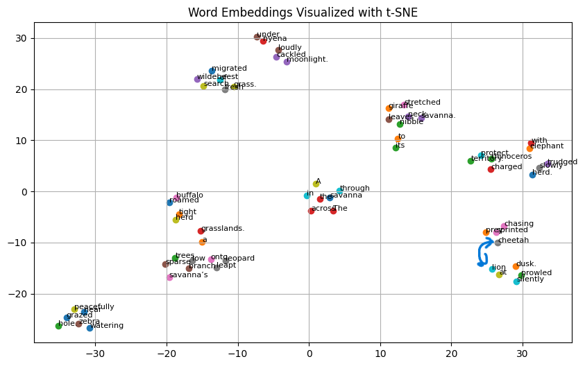

# Word2Vec from Scratch in Python 🧠✨

A simple implementation of Word2Vec using NumPy — built entirely from scratch for educational purposes.  
This project uses a small, categorized dataset animals and visualizes learned word embeddings using t-SNE.

---

## 📂 Dataset

The dataset is made of natural sentences containing words from four categories:

- 🐾 **Animals**: dog, cat, tiger, elephant, lion, ...

Example sentence:
> `"the dog barked at the cat in the garden"`

---
## 📊 Visualization Example

After training, t-SNE reduces the embedding space to 2D for plotting.



---
## 🧠 How It Works

1. **Tokenization** and **vocabulary building**
2. **Training data generation** using the Skip-gram model
3. **Weight initialization**
4. **Forward & Backward propagation** with gradient descent
5. **Learning word embeddings**
6. **t-SNE visualization** to show how similar words cluster together

---

## 🛠 Requirements

- Python 3.7+
- NumPy
- scikit-learn (for t-SNE)
- matplotlib (for plotting)

Install them using:

```bash
pip install numpy scikit-learn matplotlib
